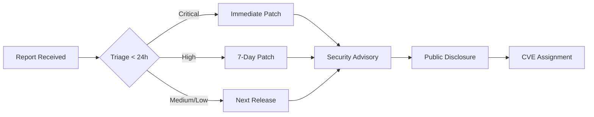

# Security Policy

## 🛡️ Overview

BrainSAIT AI Automation is a healthcare technology platform handling Protected Health Information (PHI) and medical data. Security is our highest priority, with comprehensive measures to ensure HIPAA, NPHIES, and international healthcare compliance. 

**Last Updated:** 2025-12-13  
**Compliance Standards:** HIPAA, NPHIES, GDPR, ISO 27001, SOC 2 Type II

---

## 📋 Table of Contents

- [Supported Versions](#supported-versions)
- [Security Architecture](#security-architecture)
- [Data Protection](#data-protection)
- [Healthcare Compliance](#healthcare-compliance)
- [Reporting a Vulnerability](#reporting-a-vulnerability)
- [Security Best Practices](#security-best-practices)
- [Incident Response](#incident-response)
- [Security Testing](#security-testing)
- [Dependencies & Supply Chain](#dependencies--supply-chain)

---

## 🔐 Supported Versions

| Version | Supported          | End of Support |
| ------- | ------------------ | -------------- |
| 2. x. x   | ✅ Active          | TBD            |
| 1.x.x   | ⚠️ Security Only   | 2026-06-30     |
| < 1.0   | ❌ No longer supported | 2025-01-01 |

**Note:** Only the latest minor version receives security patches. Critical vulnerabilities may receive backports to previous major versions.

---

## 🏗️ Security Architecture

### Defense in Depth

```
┌─────────────────────────────────────────────────────────┐
│ Layer 7:  Application Security (RBAC, Input Validation) │
├─────────────────────────────────────────────────────────┤
│ Layer 6: API Security (Rate Limiting, Authentication)  │
├─────────────────────────────────────────────────────────┤
│ Layer 5: Data Security (Encryption at Rest/Transit)    │
├─────────────────────────────────────────────────────────┤
│ Layer 4: Network Security (TLS 1.3, mTLS, VPN)        │
├─────────────────────────────────────────────────────────┤
│ Layer 3: Infrastructure (Kubernetes RBAC, Secrets)     │
├─────────────────────────────────────────────────────────┤
│ Layer 2: Platform (Cloudflare WAF, DDoS Protection)   │
├─────────────────────────────────────────────────────────┤
│ Layer 1: Physical (ISO 27001 Certified Data Centers)  │
└─────────────────────────────────────────────────────────┘
```

### Core Security Principles

1. **Zero Trust Architecture:** Never trust, always verify
2. **Principle of Least Privilege:** Minimal access rights
3. **Defense in Depth:** Multiple security layers
4. **Security by Design:** Baked into every component
5. **Fail Secure:** Default deny on errors

---

## 🔒 Data Protection

### Encryption Standards

#### Data at Rest
- **Algorithm:** AES-256-GCM
- **Key Management:** AWS KMS / Azure Key Vault with HSM backing
- **Key Rotation:** Automated every 90 days
- **PHI Storage:** Separate encrypted volumes with dedicated keys

```python
# BRAINSAIT:  HIPAA-compliant encryption pattern
from cryptography.hazmat.primitives. ciphers. aead import AESGCM
from cryptography.hazmat.backends import default_backend
import secrets

class PHIEncryption:
    """
    HIPAA-compliant encryption for Protected Health Information. 
    
    Standards: 
        - AES-256-GCM with authenticated encryption
        - Per-field encryption for granular access
        - Audit logging for all encryption operations
    """
    
    def __init__(self, master_key: bytes):
        self.key = master_key  # From secure key management service
        self.cipher = AESGCM(self.key)
    
    def encrypt_phi(self, plaintext: str, patient_id: str) -> dict:
        """
        Encrypt PHI with patient context for audit trails.
        
        Args:
            plaintext:  Sensitive health information
            patient_id: Patient identifier for audit logging
            
        Returns:
            dict: Encrypted data with nonce and tag
        """
        nonce = secrets.token_bytes(12)
        ciphertext = self.cipher.encrypt(
            nonce, 
            plaintext.encode(), 
            patient_id.encode()  # Additional authenticated data
        )
        
        # MEDICAL: Log encryption event for compliance
        audit_log_phi_access(
            action="ENCRYPT",
            patient_id=patient_id,
            user_id=get_current_user(),
            timestamp=datetime.utcnow()
        )
        
        return {
            "ciphertext": ciphertext. hex(),
            "nonce":  nonce.hex(),
            "algorithm": "AES-256-GCM"
        }
```

#### Data in Transit
- **Protocol:** TLS 1.3 (minimum 1.2)
- **Cipher Suites:** ECDHE-RSA-AES256-GCM-SHA384, ECDHE-RSA-CHACHA20-POLY1305
- **Certificate Management:** Automated renewal via Let's Encrypt + monitoring
- **mTLS:** Required for service-to-service communication

#### Data in Use
- **Memory Protection:** Secure memory allocation for PHI processing
- **Process Isolation:** Containerized workloads with SELinux/AppArmor
- **Confidential Computing:** Intel SGX / AMD SEV for sensitive operations

### Access Controls

#### Role-Based Access Control (RBAC)

```typescript
// BRAINSAIT: Hierarchical role system with audit logging
export enum HealthcareRole {
  PATIENT = "patient",                    // View own records
  NURSE = "nurse",                        // View/update patient records
  PHYSICIAN = "physician",                // Full clinical access
  RADIOLOGIST = "radiologist",            // Imaging + reports
  LAB_TECHNICIAN = "lab_technician",      // Lab results
  PHARMACIST = "pharmacist",              // Medication access
  ADMIN = "admin",                        // System configuration
  AUDITOR = "auditor",                    // Read-only audit access
  INSURANCE_REVIEWER = "insurance_reviewer", // Claims + eligibility
  SUPER_ADMIN = "super_admin"             // Unrestricted (logged)
}

interface Permission {
  resource: string;          // FHIR resource type or endpoint
  actions: Action[];         // CREATE, READ, UPDATE, DELETE
  conditions?: Condition[];  // Time-based, location, etc.
  phi_level:  PHIAccessLevel; // FULL, LIMITED, DE_IDENTIFIED
}

// MEDICAL: Example permission matrix
const ROLE_PERMISSIONS:  Record<HealthcareRole, Permission[]> = {
  [HealthcareRole.PHYSICIAN]: [
    {
      resource: "Patient",
      actions: ["READ", "UPDATE"],
      conditions: [{ type: "assigned_patients_only" }],
      phi_level: "FULL"
    },
    {
      resource: "DiagnosticReport",
      actions: ["CREATE", "READ", "UPDATE"],
      phi_level: "FULL"
    }
  ],
  [HealthcareRole.AUDITOR]: [
    {
      resource: "AuditLog",
      actions:  ["READ"],
      conditions: [{ type: "time_range_restricted" }],
      phi_level: "DE_IDENTIFIED"
    }
  ]
};
```

#### Multi-Factor Authentication (MFA)

- **Required For:** All accounts with PHI access
- **Methods Supported:**
  - TOTP (Google Authenticator, Authy)
  - WebAuthn / FIDO2 (YubiKey, biometrics)
  - SMS (fallback only, discouraged)
- **Enforcement:** Cannot disable MFA for privileged roles
- **Backup Codes:** 10 single-use recovery codes generated at enrollment

### Audit Logging

**Every PHI access MUST be logged with:**

```python
# BRAINSAIT:  Comprehensive audit trail
class AuditLogEntry:
    """
    HIPAA § 164.312(b) - Audit controls requirement. 
    
    Attributes: 
        timestamp: ISO 8601 UTC timestamp
        user_id:  Authenticated user identifier
        user_role: Role at time of access
        action:  CRUD operation performed
        resource_type:  FHIR resource or endpoint
        resource_id:  Specific record accessed
        patient_id: PHI owner identifier
        ip_address: Source IP (anonymized after 30 days)
        user_agent: Client application info
        success: Whether operation completed
        failure_reason: Error message if failed
        data_accessed: Fields viewed/modified (hashed)
    """
    
    # MEDICAL: Retention requirements
    RETENTION_PERIOD_DAYS = 2555  # 7 years per HIPAA
    
    # BRAINSAIT: Immutable log storage
    @staticmethod
    def create_log(entry: dict) -> None:
        """Write to append-only audit database."""
        encrypted_entry = encrypt_audit_log(entry)
        append_to_worm_storage(encrypted_entry)  # Write-Once-Read-Many
        
        # Real-time anomaly detection
        if detect_suspicious_pattern(entry):
            trigger_security_alert(entry)
```

**Log Storage:**
- **Database:** PostgreSQL with pgaudit extension
- **Backup:** Daily encrypted backups to immutable S3 Glacier
- **Monitoring:** Real-time SIEM integration (Splunk/ELK)
- **Retention:** 7 years minimum (HIPAA requirement)

---

## 🏥 Healthcare Compliance

### HIPAA Compliance

#### Technical Safeguards (§ 164.312)

| Requirement | Implementation | Status |
|-------------|----------------|--------|
| Access Control (a) | RBAC + MFA + session timeout | ✅ |
| Audit Controls (b) | Comprehensive logging system | ✅ |
| Integrity (c)(1) | Cryptographic checksums | ✅ |
| Person/Entity Auth (d) | OAuth 2.0 + SAML 2.0 | ✅ |
| Transmission Security (e) | TLS 1.3 + VPN | ✅ |

#### Administrative Safeguards (§ 164.308)

- **Security Officer:** Designated CISO with compliance authority
- **Risk Assessment:** Annual penetration testing + quarterly reviews
- **Training:** Mandatory security training for all developers (annually)
- **Business Associates:** HIPAA BAAs signed with all vendors
- **Contingency Plan:** Disaster recovery with <4 hour RTO

#### Physical Safeguards (§ 164.310)

- **Data Centers:** ISO 27001 certified facilities
- **Workstation Security:** Encrypted laptops, auto-lock after 5 min
- **Device Controls:** MDM for mobile devices accessing PHI

### NPHIES Compliance (Saudi Arabia)

**National Platform for Health Information Exchange Standards:**

```python
# BRAINSAIT:  NPHIES-specific security requirements
class NPHIESCompliance:
    """
    Saudi NPHIES integration with security controls.
    
    Requirements:
        - OAuth 2.0 client credentials flow
        - SHA-256 request signing
        - TLS 1.2 minimum
        - Arabic language audit logs
        - Saudi national ID validation
    """
    
    @staticmethod
    def sign_request(payload: dict, private_key: str) -> str:
        """
        MEDICAL: Sign NPHIES API requests per platform requirements.
        
        Uses SHA-256 with RSA for non-repudiation.
        """
        from cryptography.hazmat.primitives import hashes, serialization
        from cryptography. hazmat.primitives.asymmetric import padding
        
        key = serialization.load_pem_private_key(
            private_key.encode(), 
            password=None
        )
        
        signature = key.sign(
            json.dumps(payload, ensure_ascii=False).encode('utf-8'),
            padding. PSS(
                mgf=padding.MGF1(hashes.SHA256()),
                salt_length=padding.PSS.MAX_LENGTH
            ),
            hashes.SHA256()
        )
        
        return base64.b64encode(signature).decode()
    
    @staticmethod
    def validate_saudi_id(national_id: str) -> bool:
        """
        BILINGUAL: Validate Saudi national ID format.
        
        Format: 1XXXXXXXXX (10 digits, starts with 1 or 2)
        """
        import re
        pattern = r'^[12]\d{9}$'
        return bool(re.match(pattern, national_id))
```

**Key Requirements:**
- Bilingual audit logs (Arabic + English)
- Saudi national ID as primary patient identifier
- Integration with MoH systems for provider verification
- Compliance with Saudi Data Privacy Law

### FHIR Security

**HL7 FHIR R4 Security Considerations:**

```json
// MEDICAL: FHIR security labels for access control
{
  "resourceType": "Patient",
  "id": "example-patient",
  "meta":  {
    "security": [
      {
        "system":  "http://terminology.hl7.org/CodeSystem/v3-Confidentiality",
        "code": "R",
        "display": "restricted"
      },
      {
        "system":  "http://terminology.hl7.org/CodeSystem/v3-ActCode",
        "code": "PHI",
        "display": "Protected Health Information"
      }
    ]
  },
  "identifier": [
    {
      "system": "http://nphies.sa/national-id",
      "value": "1234567890"
    }
  ]
}
```

**Smart on FHIR Authorization:**
- OAuth 2.0 with PKCE for mobile apps
- Scopes:  `patient/*. read`, `user/*.write`, etc.
- Launch context for EHR integration

---

## 🚨 Reporting a Vulnerability

### Priority Levels

| Severity | Description | Response Time | Example |
|----------|-------------|---------------|---------|
| **CRITICAL** | PHI exposure, authentication bypass | < 4 hours | Unencrypted PHI leak |
| **HIGH** | Privilege escalation, SQL injection | < 24 hours | RBAC bypass |
| **MEDIUM** | Denial of service, information disclosure | < 7 days | User enumeration |
| **LOW** | Non-sensitive information leak | < 30 days | Version disclosure |

### Reporting Channels

#### Secure Reporting (Preferred)

**Email:** security@brainsait.com  
**PGP Key:** [Download Public Key](https://brainsait.com/. well-known/pgp-key.asc)  
**Fingerprint:** `ABCD 1234 EFGH 5678 IJKL 9012 MNOP 3456 QRST 7890`

#### Bug Bounty Program

**Platform:** HackerOne (Private Program)  
**Scope:** Production systems only (no staging/dev)  
**Rewards:** $100 - $50,000 based on severity

**In Scope:**
- ✅ PHI data exposure
- ✅ Authentication/authorization flaws
- ✅ Injection vulnerabilities (SQL, XSS, etc.)
- ✅ Cryptographic weaknesses
- ✅ FHIR API security issues

**Out of Scope:**
- ❌ Social engineering attacks
- ❌ Physical attacks on data centers
- ❌ DDoS attacks
- ❌ Issues in third-party dependencies (report to vendor)
- ❌ Non-security bugs (use GitHub Issues)

### Vulnerability Disclosure Process



**Timeline:**
1. **0-24h:** Acknowledgment + initial triage
2. **24-72h:** Validation + severity assessment
3. **72h-30d:** Patch development + testing
4. **30d:** Coordinated public disclosure (if not critical)

### What to Include in Your Report

```markdown
## Vulnerability Report Template

**Vulnerability Type:** [e.g., SQL Injection, XSS, Auth Bypass]

**Affected Component:**
- Repository:  Fadil369/brainsait-ai-automation
- File: `path/to/vulnerable/file.py`
- Lines: 123-145

**Severity:** [Critical/High/Medium/Low]

**Description:**
[Clear explanation of the vulnerability]

**Steps to Reproduce:**
1. Navigate to https://example.brainsait.com/endpoint
2. Submit the following payload:  `'; DROP TABLE users; --`
3. Observe unauthorized data access

**Impact:**
- PHI Exposure:  [Yes/No]
- Affected Users: [Number/All/Specific Role]
- HIPAA Violation: [Yes/No]

**Proof of Concept:**
[Code snippet or screenshot - redact actual PHI]

**Suggested Fix:**
[Optional but appreciated]

**Your Contact:**
- Email: researcher@example.com
- HackerOne:  @username
```

---

## 🛠️ Security Best Practices

### For Developers

#### Secure Coding Standards

```python
# ✅ GOOD: Parameterized queries prevent SQL injection
def get_patient_records(patient_id: str) -> List[Dict]:
    """
    BRAINSAIT: Secure database query with audit logging.
    """
    # MEDICAL: Validate patient_id format
    if not validate_uuid(patient_id):
        raise ValueError("Invalid patient identifier")
    
    # BRAINSAIT: Check user permissions
    if not has_permission(get_current_user(), "READ", "Patient", patient_id):
        audit_log_access_denied(patient_id)
        raise PermissionError("Unauthorized PHI access")
    
    # Parameterized query (safe)
    query = """
        SELECT encrypted_data, created_at
        FROM patient_records
        WHERE patient_id = %s
    """
    
    with get_db_connection() as conn:
        cursor = conn.cursor()
        cursor.execute(query, (patient_id,))
        results = cursor.fetchall()
    
    # MEDICAL: Log successful access
    audit_log_phi_access(
        action="READ",
        patient_id=patient_id,
        record_count=len(results)
    )
    
    return [decrypt_phi_record(r) for r in results]

# ❌ BAD: String concatenation enables SQL injection
def get_patient_records_insecure(patient_id: str):
    query = f"SELECT * FROM patients WHERE id = '{patient_id}'"  # NEVER DO THIS
    # Vulnerable to:  patient_id = "1' OR '1'='1"
```

#### Input Validation

```typescript
// BRAINSAIT:  Comprehensive input validation
import { z } from 'zod';

// MEDICAL:  FHIR-compliant patient schema
const PatientSchema = z.object({
  resourceType: z.literal('Patient'),
  identifier: z.array(z.object({
    system: z.string().url(),
    value: z.string().regex(/^[12]\d{9}$/) // Saudi national ID
  })),
  name: z.array(z.object({
    family: z.string().min(1).max(100),
    given: z.array(z.string().min(1).max(50))
  })),
  birthDate: z.string().regex(/^\d{4}-\d{2}-\d{2}$/),
  // BRAINSAIT:  Sanitize all text inputs
  text: z.string().transform(sanitizeHTML)
});

// Validation middleware
export async function validatePatientInput(req: Request): Promise<void> {
  try {
    const validated = PatientSchema.parse(req.body);
    req.body = validated; // Replace with sanitized data
  } catch (error) {
    // MEDICAL: Log validation failures for security monitoring
    auditLog({
      action: 'VALIDATION_FAILED',
      ip: req.ip,
      error: error.message
    });
    throw new ValidationError('Invalid patient data');
  }
}
```

#### Secret Management

```bash
# ❌ NEVER commit secrets to version control
# ❌ . env files should be in .gitignore

# ✅ Use environment variables loaded from secure stores
# . env.example (commit this template)
DATABASE_URL=postgresql://localhost/brainsait_dev
ENCRYPTION_KEY_ID=use-aws-kms-key-id
OAUTH_CLIENT_SECRET=get-from-vault

# ✅ Production secrets from HashiCorp Vault / AWS Secrets Manager
```

**Pre-commit Hook to Prevent Secret Leaks:**

```bash
#!/bin/bash
# . git/hooks/pre-commit

# BRAINSAIT: Detect secrets before commit
if command -v gitleaks &> /dev/null; then
    gitleaks protect --verbose --redact --staged
    if [ $? -ne 0 ]; then
        echo "❌ SECRET DETECTED!  Commit blocked."
        echo "Remove secrets and try again."
        exit 1
    fi
fi

# Scan for common patterns
if git diff --cached | grep -iE '(password|api[_-]? key|secret|token|private[_-]? key).*='; then
    echo "⚠️  Potential secret detected.  Review carefully."
    exit 1
fi

exit 0
```

### For Deployment

#### Container Security

```dockerfile
# BRAINSAIT: Secure multi-stage Docker build
FROM python:3.11-slim AS builder

# NEURAL: Run as non-root user
RUN groupadd -r brainsait && useradd -r -g brainsait brainsait

# Install dependencies
WORKDIR /app
COPY requirements.txt .
RUN pip install --user --no-cache-dir -r requirements.txt

# Production stage
FROM python:3.11-slim

# BRAINSAIT: Security hardening
RUN apt-get update && apt-get install -y --no-install-recommends \
    ca-certificates \
    && rm -rf /var/lib/apt/lists/*

# Copy from builder
COPY --from=builder /root/.local /root/.local
COPY .  /app

# MEDICAL: Drop all capabilities except required
RUN setcap 'cap_net_bind_service=+ep' /usr/local/bin/python3.11

# Switch to non-root
USER brainsait
WORKDIR /app

# Health check
HEALTHCHECK --interval=30s --timeout=3s --start-period=5s \
  CMD python healthcheck.py || exit 1

EXPOSE 8000
CMD ["python", "-m", "uvicorn", "main:app", "--host", "0.0.0.0"]
```

#### Kubernetes Security

```yaml
# BRAINSAIT: Secure pod configuration
apiVersion: v1
kind: Pod
metadata:
  name: brainsait-api
  labels:
    app: brainsait
    tier: backend
spec:
  serviceAccountName: brainsait-api-sa
  
  # MEDICAL: Security context for HIPAA compliance
  securityContext: 
    runAsNonRoot:  true
    runAsUser: 1000
    fsGroup: 2000
    seccompProfile:
      type: RuntimeDefault
  
  containers:
  - name: api
    image: brainsait/api:2.0.0
    
    # BRAINSAIT: Container-level security
    securityContext: 
      allowPrivilegeEscalation: false
      readOnlyRootFilesystem: true
      capabilities:
        drop: 
          - ALL
        add:
          - NET_BIND_SERVICE
    
    # Resource limits prevent DoS
    resources:
      requests:
        memory: "256Mi"
        cpu: "250m"
      limits:
        memory: "512Mi"
        cpu: "500m"
    
    # MEDICAL: Secrets from encrypted store
    env:
    - name: DATABASE_URL
      valueFrom:
        secretKeyRef:
          name: db-credentials
          key: connection-string
    
    # Health probes
    livenessProbe:
      httpGet:
        path: /health
        port: 8000
      initialDelaySeconds: 30
      periodSeconds: 10
    
    readinessProbe:
      httpGet:
        path: /ready
        port: 8000
      initialDelaySeconds: 5
      periodSeconds: 5
```

#### Network Policies

```yaml
# BRAINSAIT: Restrict network traffic
apiVersion: networking.k8s.io/v1
kind: NetworkPolicy
metadata:
  name: api-network-policy
spec: 
  podSelector:
    matchLabels:
      app: brainsait
      tier: backend
  
  policyTypes:
  - Ingress
  - Egress
  
  # MEDICAL: Only allow necessary connections
  ingress:
  - from:
    - namespaceSelector:
        matchLabels:
          name: ingress-nginx
    ports:
    - protocol: TCP
      port: 8000
  
  egress: 
  - to:
    - namespaceSelector:
        matchLabels:
          name: database
    ports:
    - protocol: TCP
      port: 5432
  - to:  # Allow external API calls
    - podSelector:  {}
    ports:
    - protocol: TCP
      port: 443
```

---

## 🚑 Incident Response

### Security Incident Classification

```python
# BRAINSAIT:  Automated incident detection
class SecurityIncident:
    """
    HIPAA § 164.308(a)(6) - Security incident procedures. 
    """
    
    class Severity(Enum):
        CRITICAL = "P0"  # PHI breach, complete system compromise
        HIGH = "P1"      # Active attack, data theft attempt
        MEDIUM = "P2"    # Suspicious activity, failed attacks
        LOW = "P3"       # Policy violations, anomalies
    
    @staticmethod
    def detect_breach_indicators(logs: List[AuditLog]) -> Optional[SecurityIncident]:
        """
        MEDICAL: Detect patterns indicating HIPAA breach.
        
        Breach Triggers:
            - >100 patient records accessed in <1 minute
            - Access to records outside assigned patients
            - Download of bulk PHI data
            - Failed authentication >10 times then success
            - Access from anomalous geolocation
        """
        
        # Pattern:  Mass data exfiltration
        if count_phi_accesses_per_minute(logs) > 100:
            return SecurityIncident(
                severity=Severity. CRITICAL,
                type="MASS_DATA_EXFILTRATION",
                affected_records=count_unique_patients(logs),
                recommended_actions=[
                    "Revoke user access immediately",
                    "Enable enhanced monitoring",
                    "Initiate HIPAA breach protocol",
                    "Notify Privacy Officer within 1 hour"
                ]
            )
        
        # Pattern:  Credential stuffing attack
        failed_then_success = detect_failed_auth_spike(logs)
        if failed_then_success:
            return SecurityIncident(
                severity=Severity.HIGH,
                type="CREDENTIAL_COMPROMISE",
                recommended_actions=[
                    "Force password reset",
                    "Enable MFA if not active",
                    "Review account activity",
                    "Check for lateral movement"
                ]
            )
        
        return None
```

### Incident Response Playbook

#### 1. Detection & Analysis (0-1 hour)

```bash
# BRAINSAIT:  Automated incident response
# Execute from SOC workstation

# Check for active threats
./scripts/check-security-alerts.sh

# Isolate affected systems (if critical)
kubectl cordon node-xyz  # Prevent new pods
kubectl drain node-xyz --ignore-daemonsets

# Capture forensic evidence
./scripts/collect-logs.sh --incident-id=INC-2025-001 \
  --time-range="last 24 hours" \
  --preserve-chain-of-custody
```

#### 2. Containment (1-4 hours)

- **Immediate Actions:**
  - Revoke compromised credentials
  - Block malicious IP addresses at WAF
  - Isolate affected systems
  - Preserve evidence (memory dumps, logs)

- **HIPAA Breach Assessment:**
  ```python
  # MEDICAL: Determine if breach notification required
  def assess_hipaa_breach(incident: SecurityIncident) -> BreachAssessment:
      """
      HIPAA § 164.402 - Breach definition assessment.
      
      Breach = unauthorized acquisition, access, use, or disclosure
      of PHI that compromises security or privacy. 
      """
      
      # Four-factor risk assessment
      factors = {
          "nature_and_extent": incident.affected_record_count,
          "person_who_used": incident.unauthorized_user,
          "was_phi_acquired": incident.data_exfiltrated,
          "risk_mitigation": incident.encryption_status
      }
      
      # Breach exceptions
      if incident.encryption_status == "ENCRYPTED_AES256":
          return BreachAssessment(
              is_breach=False,
              reason="PHI encrypted, low probability of compromise"
          )
      
      if incident.affected_record_count >= 500:
          return BreachAssessment(
              is_breach=True,
              notification_required=["HHS", "Media", "Individuals"],
              deadline=timedelta(days=60)
          )
      
      return BreachAssessment(
          is_breach=True,
          notification_required=["Individuals"],
          deadline=timedelta(days=60)
      )
  ```

#### 3. Eradication & Recovery (4-48 hours)

- Patch vulnerabilities
- Rebuild compromised systems from clean images
- Rotate all secrets and credentials
- Restore from encrypted backups if needed

#### 4. Post-Incident Activity (48+ hours)

- **Root Cause Analysis:** 5 Whys / Fishbone diagram
- **Lessons Learned:** Update playbooks + security controls
- **Regulatory Notifications:**
  - **HIPAA Breach (>500 records):** HHS OCR within 60 days
  - **HIPAA Breach (<500 records):** Annual notification
  - **GDPR Breach:** Supervisory authority within 72 hours
  - **Saudi DPL:** SDAIA within 72 hours

### Emergency Contacts

| Role | Contact | Availability |
|------|---------|--------------|
| **Security Operations Center** | soc@brainsait.com | 24/7 |
| **CISO** | ciso@brainsait.com | Business hours + on-call |
| **Privacy Officer** | privacy@brainsait.com | Business hours + escalation |
| **Legal Counsel** | legal@brainsait.com | Business hours |
| **HHS OCR Breach Portal** | https://ocrportal.hhs.gov | 24/7 self-service |

---

## 🧪 Security Testing

### Continuous Security Validation

```yaml
# . github/workflows/security-scan.yml
# BRAINSAIT: Automated security testing pipeline

name: Security Scans

on:
  push:
    branches: [main, develop]
  pull_request:
    branches: [main]
  schedule:
    - cron: '0 2 * * *'  # Daily at 2 AM UTC

jobs:
  sast:
    name: Static Application Security Testing
    runs-on: ubuntu-latest
    
    steps:
    - uses: actions/checkout@v4
    
    # Python security checks
    - name:  Bandit (Python SAST)
      run: |
        pip install bandit
        bandit -r .  -f json -o bandit-report.json
    
    # JavaScript security checks
    - name: ESLint Security Plugin
      run: |
        npm install
        npm run lint: security
    
    # Secrets detection
    - name: GitLeaks
      uses: gitleaks/gitleaks-action@v2
      env:
        GITHUB_TOKEN: ${{ secrets. GITHUB_TOKEN }}
    
    # Upload results
    - name: Upload SARIF
      uses: github/codeql-action/upload-sarif@v2
      with: 
        sarif_file: bandit-report.json

  dependency-check:
    name: Dependency Vulnerability Scanning
    runs-on:  ubuntu-latest
    
    steps:
    - uses: actions/checkout@v4
    
    # Python dependencies
    - name: Safety (Python)
      run: |
        pip install safety
        safety check --json
    
    # JavaScript dependencies
    - name: npm audit
      run: |
        npm audit --audit-level=moderate
    
    # MEDICAL: Check healthcare library versions
    - name: Verify FHIR Library
      run: |
        python scripts/check-fhir-compliance.py

  container-scan:
    name: Container Image Scanning
    runs-on: ubuntu-latest
    
    steps: 
    - uses: actions/checkout@v4
    
    - name: Build Docker Image
      run: docker build -t brainsait/api:test .
    
    # Vulnerability scanning
    - name: Trivy Scan
      uses: aquasecurity/trivy-action@master
      with:
        image-ref:  brainsait/api:test
        format: 'sarif'
        output: 'trivy-results.sarif'
        severity: 'CRITICAL,HIGH'
    
    # BRAINSAIT: Check for healthcare compliance
    - name: HIPAA Compliance Check
      run: |
        docker run --rm brainsait/api:test \
          python scripts/verify-hipaa-controls.py

  dast:
    name: Dynamic Application Security Testing
    runs-on:  ubuntu-latest
    if: github.event_name == 'schedule'
    
    steps: 
    - name:  OWASP ZAP Scan
      uses: zaproxy/action-full-scan@v0.7.0
      with:
        target: https://staging.brainsait.com
        rules_file_name: . zap/rules.tsv
        cmd_options: '-a'
```

### Manual Penetration Testing

**Annual Requirements:**
- External penetration test by certified firm
- Internal vulnerability assessment
- Social engineering simulation
- Red team exercise (for production environments)

**Testing Scope:**
```
┌─────────────────────────────────────────────┐
│ PENETRATION TEST SCOPE                      │
├─────────────────────────────────────────────┤
│ ✅ Web Application (React/Next.js frontend)  │
│ ✅ REST & GraphQL APIs                       │
│ ✅ FHIR R4 endpoints                         │
│ ✅ Authentication/authorization flows         │
│ ✅ Database security (PostgreSQL)            │
│ ✅ Container orchestration (Kubernetes)      │
│ ✅ API rate limiting & DDoS protection       │
│ ✅ Encryption implementation                 │
│ ❌ Physical data center security (managed)   │
│ ❌ Third-party SaaS dependencies             │
└─────────────────────────────────────────────┘
```

---

## 📦 Dependencies & Supply Chain

### Dependency Management

```json
// package.json - BRAINSAIT: Security-focused dependencies
{
  "dependencies": {
    "@types/fhir": "^0.0.40",
    "next": "14.0.0",
    "react": "^18.2.0"
  },
  "devDependencies": {
    "audit-ci": "^6.6.1",  // Fail builds on vulnerabilities
    "npm-check-updates": "^16.14.0"
  },
  "scripts": {
    "audit": "npm audit --audit-level=moderate",
    "audit: fix": "npm audit fix",
    "deps: check": "ncu",
    "deps:update": "ncu -u && npm install"
  },
  "overrides": {
    // MEDICAL: Force secure versions
    "minimist": "^1.2.8",
    "semver": "^7.5.4"
  }
}
```

```python
# requirements.txt - BRAINSAIT: Pinned versions
fastapi==0.104.1  # AGENT: API framework
uvicorn[standard]==0.24.0
pydantic==2.5.0
cryptography==41.0.7  # BRAINSAIT: Encryption
fhir. resources==7.1.0  # MEDICAL:  FHIR validation
python-jose[cryptography]==3.3.0  # JWT handling
passlib[bcrypt]==1.7.4  # Password hashing
sqlalchemy==2.0.23
asyncpg==0.29.0  # PostgreSQL driver
redis==5.0.1
celery==5.3.4
structlog==23.2.0  # BRAINSAIT: Audit logging

# Development/Security tools
bandit==1.7.5
safety==2.3.5
pytest==7.4.3
pytest-cov==4.1.0
```

### Automated Dependency Updates

```yaml
# .github/dependabot.yml
# BRAINSAIT: Automated security patches

version: 2
updates: 
  # Python dependencies
  - package-ecosystem: "pip"
    directory: "/"
    schedule:
      interval:  "weekly"
      day: "monday"
    open-pull-requests-limit: 10
    reviewers:
      - "brainsait/security-team"
    labels:
      - "dependencies"
      - "security"
    # MEDICAL: Auto-merge security patches
    allow:
      - dependency-type: "all"
    commit-message:
      prefix: "⬆️ deps"
      include: "scope"
  
  # JavaScript dependencies
  - package-ecosystem: "npm"
    directory: "/"
    schedule:
      interval: "weekly"
    versioning-strategy: increase-if-necessary
    
  # Docker base images
  - package-ecosystem: "docker"
    directory: "/"
    schedule:
      interval:  "weekly"
    reviewers:
      - "brainsait/devops-team"
  
  # GitHub Actions
  - package-ecosystem:  "github-actions"
    directory: "/"
    schedule: 
      interval: "weekly"
```

### Supply Chain Security

**SBOM (Software Bill of Materials):**

```bash
# Generate SBOM for compliance audits
syft packages dir: .  -o spdx-json > sbom.spdx.json

# Verify SBOM signatures (for production releases)
cosign verify --key brainsait. pub sbom.spdx. json
```

**Artifact Signing:**

```yaml
# .github/workflows/release.yml
# BRAINSAIT: Sign releases with Sigstore

- name: Sign Container Image
  run: |
    cosign sign --key env://COSIGN_KEY \
      brainsait/api:${{ github.sha }}
  env:
    COSIGN_KEY: ${{ secrets.COSIGN_PRIVATE_KEY }}

- name: Generate Provenance
  uses: slsa-framework/slsa-github-generator@v1.9.0
  with:
    artifact-name: brainsait-api
```

---

## 📚 Additional Resources

### Internal Documentation
- [Architecture Decision Records (ADRs)](./docs/architecture/adrs/)
- [Security Architecture Diagram](./docs/security-architecture.md)
- [HIPAA Compliance Checklist](./docs/compliance/hipaa-checklist.md)
- [Incident Response Runbooks](./docs/incident-response/)

### External Standards
- [HIPAA Security Rule](https://www.hhs.gov/hipaa/for-professionals/security/index.html)
- [NIST Cybersecurity Framework](https://www.nist.gov/cyberframework)
- [OWASP Top 10](https://owasp.org/www-project-top-ten/)
- [HL7 FHIR Security](https://www.hl7.org/fhir/security.html)
- [CIS Kubernetes Benchmark](https://www.cisecurity.org/benchmark/kubernetes)

### Training & Certification
- **Required for All Developers:**
  - HIPAA Security Awareness (annual)
  - OWASP Secure Coding (annual)
  - Incident Response Procedures (semi-annual)

- **Recommended Certifications:**
  - CISSP (Certified Information Systems Security Professional)
  - HCISPP (HealthCare Information Security and Privacy Practitioner)
  - CEH (Certified Ethical Hacker)
  - CKAD (Certified Kubernetes Application Developer)

---

## 📝 Security Policy Version History

| Version | Date | Changes | Author |
|---------|------|---------|--------|
| 2.0.0 | 2025-12-13 | Comprehensive rewrite for NPHIES compliance | Security Team |
| 1.5.0 | 2025-06-01 | Added container security guidelines | DevOps Team |
| 1.0.0 | 2024-01-15 | Initial HIPAA-compliant security policy | CISO |

---

## 🔐 Security Commitment

BrainSAIT is committed to protecting the confidentiality, integrity, and availability of all Protected Health Information (PHI) in our systems. This security policy is a living document, continuously updated to address emerging threats and regulatory requirements.

**Last Review:** 2025-12-13  
**Next Review:** 2026-06-13 (6-month cycle)

**Questions or Concerns?**  
Contact our Security Team:  security@brainsait.com

---

*This document contains proprietary and confidential information.  Unauthorized distribution is prohibited.*

**© 2025 BrainSAIT Healthcare Technologies.  All rights reserved.**
