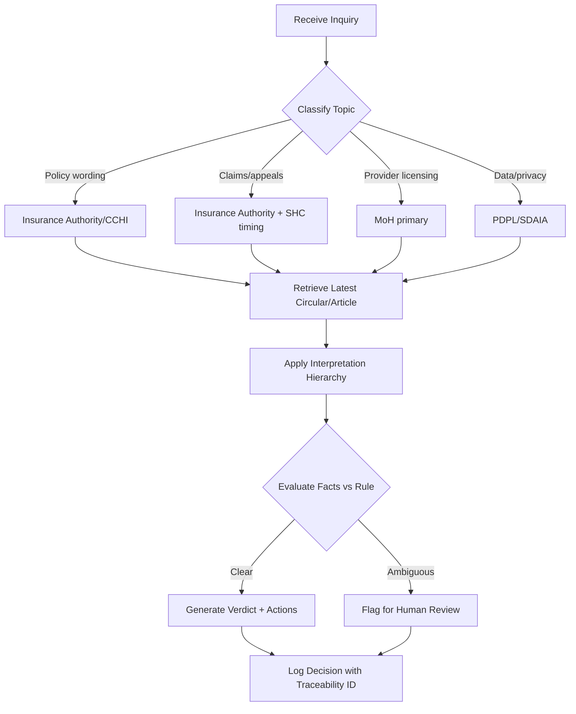

# Saudi Healthcare Insurance Regulatory Compliance Skill

**Domain**: Compliance with Saudi Insurance Authority (formerly CCHI) and Ministry of Health regulations  
**Application**: Saudi market (Arabic + English bilingual)  
**Complexity Level**: Advanced  
**Update Frequency**: Immediate on new circulars/decisions; weekly automated sweep for amendments  
**Spec Reference**: `../../specs/saudi-healthcare-regulatory-compliance.spec.md`

---

## Purpose & Business Outcomes

- Deliver authoritative, citation-backed guidance on healthcare insurance compliance (benefits design, claims adjudication, underwriting, member rights, provider contracts).
- Cite the exact Saudi source (Insurance Authority/CCHI unified policy, MoH directives, Health Council decisions, SDAIA PDPL data/privacy guidance) in every response.
- Return a clear action list (comply / remediate / escalate) with severity, owner, and due dates.
- Reduce compliance risk exposure and audit findings for insurers operating in the Saudi market.

---

## Regulatory Scope (Authoritative Sources)

| Authority | Scope | Key Documents |
|-----------|-------|---------------|
| **Insurance Authority / CCHI** | Policy wording, waiting periods, exclusions, underwriting, claims processing | Unified Policy, Private Health Insurance Law, circulars |
| **Ministry of Health (MoH)** | Provider licensing, clinical protocols impacting payer duties | Licensing regulations, clinical directives |
| **Saudi Health Council (SHC)** | Pricing references, clinical coding/DRG guidance | Tariff schedules, coding standards |
| **SDAIA (PDPL)** | Personal data protection, health data retention | PDPL regulations, sectoral guidance |

> **Citation Format**: `[Authority] - [Document/Article] - [Date]` — every response must include this.

---

## Core Components

### 1. Saudi Regulations Library

- **CCHI / Insurance Authority**: Unified Policy & circulars (Arabic primary source)
- **Healthcare insurance business regulation**: Licensing requirements, capital adequacy
- **Data protection**: PDPL compliance for PHI/PII handling
- **Health Council pricing/coding**: Payer obligation references where applicable

### 2. Local Interpretation Framework

- Official circular interpretation hierarchy: Authority → Council → Ministry guidance
- Precedent log of regulator FAQs and clarifications
- Localization rules: Arabic-first citations; English summaries permitted

### 3. Evidence & Traceability

- Citation string: `[Authority] - [Doc/Article] - [Date]`
- Response structure: citation → compliance verdict → remediation steps → owner → due date
- Decision ID for audit trail

---

## Inputs (Expected)

| Input Type | Description | Example |
|------------|-------------|---------|
| Policy/benefit wording | Coverage terms, waiting periods, exclusions | "12-month maternity waiting period clause" |
| Claim scenario | Diagnosis/procedure codes, dates of service, provider type | "ICD-10: O80, DOS: 2025-06-15, network hospital" |
| Provider contract terms | Network tiering, reimbursement model | "Tier 1 hospital, DRG-based reimbursement" |
| Member inquiry/complaint | Arabic/English text | "Claim denied for emergency care at non-network facility" |
| Language preference | `ar` (default) or `en` | — |

---

## Outputs (Standard Response)

| Field | Description |
|-------|-------------|
| **Verdict** | `compliant` \| `non-compliant` \| `ambiguous (needs regulator confirmation)` |
| **Evidence** | Exact Arabic citation (document title, article/circular number, date) |
| **Required Actions** | Steps with accountable role and target date |
| **Customer-safe Message** | Bilingual summary with non-binding legal disclaimer |
| **Traceability** | Decision ID, source document version |

---

## Operational Workflow

### Detailed Steps

1. **Classify** the inquiry: policy wording, claims handling, underwriting, provider contract, data/privacy.
2. **Map authority priority**: Insurance Authority/CCHI → SHC → MoH → PDPL.
3. **Retrieve** most recent circular/article (Arabic source preferred); capture version/date.
4. **Apply interpretation hierarchy**: law → implementing regulation → circular → FAQ/clarification.
5. **Evaluate** facts vs. rule; note assumptions and missing data.
6. **Produce** bilingual response with citation string, verdict, and action list (owner + due date).
7. **Flag edge cases** for human review (emergency care, maternity, chronic diseases, appeals, data privacy).
8. **Log** decision with traceability ID; store citation and source version for audit.

---

## Edge Cases & Special Handling

| Scenario | Handling |
|----------|----------|
| **Emergency care out-of-network** | Must be covered per Insurance Authority emergency rule; cite specific article |
| **Maternity waiting periods** | Check latest circular for permitted waiting period limits |
| **Chronic disease coverage** | Verify pre-existing condition rules and mandatory coverage requirements |
| **Pre-authorization delays** | Apply SHC/MoH timing requirements; cite appeal SLA |
| **PHI data handling** | PDPL compliance mandatory; redact identifiers in stored traces |

---

## Guardrails & Responsibility Limits

- **No binding legal advice**: Responses are compliance interpretations with citations, not legal opinions.
- **Escalation required**: Ambiguous items must be escalated to certified Saudi legal/compliance officer.
- **Currency requirement**: Always include citation date and version; never rely on outdated circulars (>90 days without verification).
- **Audit readiness**: All decisions logged with traceability ID for regulatory inspection.

---

## Monitoring & Updates

- **Automated weekly sweep**: Scan for new circulars from Insurance Authority, MoH, SHC.
- **Immediate refresh**: On detection of high-impact regulatory update.
- **Change log entry**: Source, date, impacted rules, action required, owner.
- **Regression checklist**: Emergency coverage, maternity, chronic disease, appeals SLA, data privacy.

---

## Quality & KPIs

| Metric | Target |
|--------|--------|
| Citation accuracy | ≥ 99% |
| Outdated citation rate | < 1% |
| Response time | < 120 seconds per inquiry |
| Completeness | 100% (verdict + citation + actions in every response) |
| Escalation rate | Track; optimize over time |

---

## Attached / Supporting Files

- `cchi-regulations-implementation.md`: Cooperative Health Insurance system implementation guide
- `sahi-regulatory-updates.md`: Update log for Insurance Authority/SHC/MoH circulars
- `saudi-healthcare-laws.md`: Consolidated Arabic source links (law, regulations, circulars)
- **Specs-Kit reference**: `../../specs/saudi-healthcare-regulatory-compliance.spec.md`

---

## Saudi Market Specifics

- **Arabic-first**: Official citations in Arabic; English summary beneath
- **Cultural alignment**: Respect local practices and Health Council approved terminology
- **Pricing awareness**: Understand Health Council approved price structure and DRG references
- **Bilingual output**: All customer-facing messages in both Arabic and English
