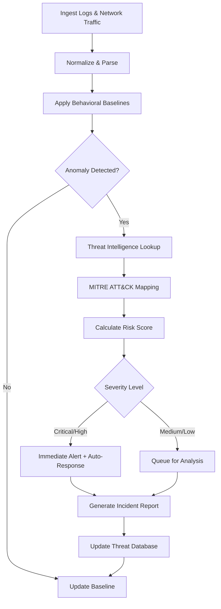

# Threat Analysis Skill

**Domain**: Cybersecurity & Threat Detection  
**Complexity Level**: Very Advanced  
**Estimated Time for Execution**: < 5 seconds  
**Frequency**: Continuous (24/7 monitoring)  
**Spec Reference**: `../../specs/threat-analysis.spec.md`

---

## Purpose & Business Outcomes
- Provide real-time threat detection and network activity monitoring
- Analyze security logs and identify anomalies with high precision
- Enable proactive threat intelligence and rapid incident response
- Reduce security incident response time from hours to seconds
- Minimize false positives through advanced ML-based anomaly detection

---

## Core Components

### 1. Log Analysis Engine
- **SIEM Integration**: Connects with Splunk, ELK Stack, Azure Sentinel, Chronicle
- **Log Parsing**: Multi-format support (Syslog, CEF, JSON, Windows Event Logs)
- **Real-time Processing**: Stream processing with <5 second latency
- **Historical Analysis**: Time-series pattern recognition and baseline establishment

### 2. Anomaly Detection Algorithms
- **Behavioral Analysis**: User and Entity Behavior Analytics (UEBA)
- **Network Traffic Analysis**: DPI (Deep Packet Inspection) integration
- **ML Models**: Random Forest, Isolation Forest, LSTM for temporal patterns
- **Threat Intelligence**: Integration with MITRE ATT&CK framework

### 3. Alert Classification System
- **Severity Levels**: Critical, High, Medium, Low, Informational
- **Priority Scoring**: Risk-based prioritization with business context
- **False Positive Reduction**: Continuous learning from analyst feedback
- **Automated Enrichment**: IOC lookup, threat actor attribution, CVE mapping

---

## Inputs (Expected)

| Input Type | Description | Example |
|------------|-------------|---------|
| Log streams | Real-time security logs from infrastructure | Firewall logs, IDS/IPS alerts, endpoint logs |
| Network traffic | Packet captures and flow data | NetFlow, PCAP, Zeek logs |
| Threat intelligence feeds | External IOC feeds and reputation data | VirusTotal, AlienVault OTX, STIX/TAXII |
| Security policies | Organization-specific rules and baselines | Acceptable use policy, network segmentation rules |
| Language preference | `en` (default) or `ar` | — |

---

## Outputs (Standard Response)

| Field | Description |
|-------|-------------|
| **Alert ID** | Unique identifier for tracking and correlation |
| **Severity** | `critical` \| `high` \| `medium` \| `low` \| `info` |
| **Threat Type** | Malware, Phishing, Data Exfiltration, Brute Force, etc. |
| **Affected Assets** | List of compromised or targeted systems |
| **IOCs** | IP addresses, domains, file hashes, URLs |
| **MITRE ATT&CK TTPs** | Mapped tactics, techniques, and procedures |
| **Recommended Actions** | Immediate containment steps with priority order |
| **Confidence Score** | 0-100% indicating detection confidence |
| **Evidence Chain** | Log excerpts, packet captures, forensic artifacts |
| **Timeline** | Event sequence from initial detection to current state |
| **Bilingual Summary** | English and Arabic incident description |

---

## Operational Workflow

### Detailed Steps
1. **Ingest**: Collect logs from firewalls, EDR, SIEM, cloud platforms (AWS CloudTrail, Azure Monitor, GCP Cloud Logging)
2. **Normalize**: Convert diverse log formats into unified schema
3. **Baseline**: Establish normal behavior patterns for users, systems, and network segments
4. **Detect**: Apply ML models and rule-based detection for anomalies
5. **Enrich**: Query threat intelligence feeds for IOC reputation and context
6. **Classify**: Map to MITRE ATT&CK framework and assign severity
7. **Prioritize**: Calculate risk score based on asset criticality and threat context
8. **Alert**: Generate bilingual alert with evidence and recommended actions
9. **Track**: Log all detections for compliance and threat hunting

---

## Detection Categories

### Network-Based Threats
- **C2 Communication**: Command & Control beacon detection
- **Data Exfiltration**: Unusual outbound data transfers
- **Port Scanning**: Reconnaissance activity
- **DDoS Indicators**: Traffic volume anomalies

### Endpoint-Based Threats
- **Malware Execution**: Process creation anomalies, suspicious file writes
- **Privilege Escalation**: Unauthorized admin access attempts
- **Lateral Movement**: Suspicious authentication patterns
- **Persistence Mechanisms**: Registry modifications, scheduled tasks

### Application-Based Threats
- **SQL Injection**: Database query anomalies
- **XSS Attempts**: Script injection in web traffic
- **API Abuse**: Unusual API call patterns
- **Authentication Failures**: Brute force, credential stuffing

### Cloud-Specific Threats
- **Misconfiguration**: Exposed S3 buckets, overly permissive IAM roles
- **Resource Abuse**: Cryptomining, resource hijacking
- **Account Compromise**: Impossible travel, unusual API calls

---

## Edge Cases & Special Handling

| Scenario | Handling |
|----------|----------|
| **High false positive rate** | Tune ML model thresholds; add business context rules |
| **Zero-day exploit** | Behavioral detection (no signature required); immediate escalation |
| **Encrypted traffic** | SSL/TLS decryption (with proper authorization); certificate analysis |
| **Insider threat** | UEBA correlation across multiple data sources; privacy considerations |
| **APT (Advanced Persistent Threat)** | Long-term pattern analysis; threat hunting workflows |
| **Multi-stage attack** | Event correlation across extended timeframes; kill chain mapping |

---

## Guardrails & Responsibility Limits

- **Privacy Compliance**: Ensure GDPR/PDPL compliance when analyzing user data; no retention of PII beyond investigation needs
- **Authorization Required**: Network traffic inspection must be authorized by security policy
- **Escalation Required**: Critical alerts (severity ≥ High) escalate to SOC analyst within 2 minutes
- **Audit Trail**: All detections logged for compliance and forensic purposes
- **No Automated Blocking**: Containment actions require human approval (except pre-approved playbooks)

---

## Monitoring & Updates

- **Model Retraining**: Weekly retraining with new threat data and analyst feedback
- **Threat Intelligence Updates**: Hourly sync with threat feeds
- **Baseline Refresh**: Daily recalculation of behavioral baselines
- **False Positive Review**: Weekly review of dismissed alerts to improve accuracy
- **Performance Metrics**: Monitor detection latency (target: <5 seconds), false positive rate (target: <5%)

---

## Quality & KPIs

| Metric | Target |
|--------|--------|
| Detection latency | < 5 seconds |
| False positive rate | < 5% |
| Threat coverage | ≥ 95% MITRE ATT&CK techniques |
| Alert accuracy | ≥ 90% |
| Time to containment | < 15 minutes for critical threats |
| Uptime | ≥ 99.9% |

---

## Integration Requirements

- **SIEM Platforms**: Splunk, ELK, Azure Sentinel, Chronicle, IBM QRadar
- **EDR/XDR**: CrowdStrike, SentinelOne, Microsoft Defender
- **Network Sensors**: Palo Alto, Fortinet, Cisco, Zeek
- **Cloud Platforms**: AWS GuardDuty, Azure Security Center, GCP Security Command Center
- **Threat Intelligence**: MISP, OpenCTI, ThreatConnect, Anomali
- **Ticketing**: ServiceNow, Jira, PagerDuty for incident management

---

## Attached / Supporting Files

- `mitre-attack-mapping.md`: Complete mapping of detections to ATT&CK framework
- `threat-intel-sources.md`: Configured threat intelligence feeds and APIs
- `detection-rules.yaml`: Custom detection rules and thresholds
- `baseline-config.json`: Behavioral baseline parameters
- **Specs-Kit reference**: `../specs/threat-analysis.spec.md`

---

## Saudi Market Specifics

- **Arabic Language Support**: All alerts available in Arabic for local SOC teams
- **SAMA Compliance**: Align with Saudi Central Bank cybersecurity framework
- **NCA Requirements**: Meet National Cybersecurity Authority essential controls
- **Localized Threat Intelligence**: Focus on Middle East threat actors and regional IOCs
- **Business Hours Awareness**: Adjust baselines for Saudi work week (Sunday-Thursday)
- **Cultural Sensitivity**: Respect privacy norms in user monitoring
