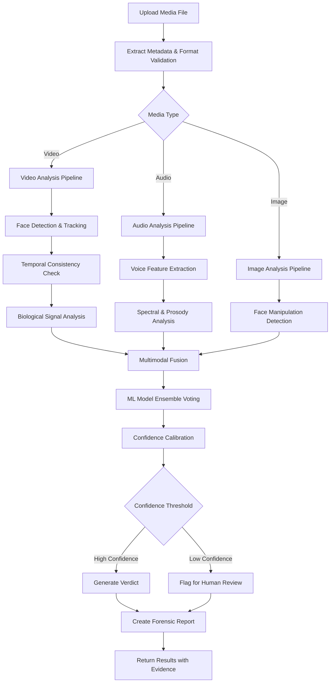

# Deepfake Detection Skill

**Domain**: Cybersecurity & Media Authentication  
**Complexity Level**: Advanced  
**Estimated Time for Execution**: < 10 seconds  
**Detection Accuracy**: > 98%  
**Frequency**: On-demand per media file  
**Spec Reference**: `../../specs/deepfake-detection.spec.md`

---

## Purpose & Business Outcomes
- Verify authenticity of video and audio content to combat misinformation
- Detect AI-generated synthetic media (deepfakes) with high accuracy
- Protect brand reputation and prevent fraud via impersonation
- Enable trust verification for critical communications (executive messages, legal evidence)
- Provide forensic-grade analysis for legal and compliance purposes

---

## Core Components

### 1. Video Deepfake Detection Engine
- **Face Manipulation Detection**: Detects face swaps, face reenactment, facial attribute editing
- **Temporal Consistency Analysis**: Identifies frame-to-frame inconsistencies in lighting, shadows, reflections
- **Biological Signal Analysis**: Detects absence or anomalies in micro-expressions, eye blinking, pulse detection
- **Compression Artifact Analysis**: Identifies recompression signatures typical of deepfake pipelines
- **Neural Network Models**: EfficientNet-B7, XceptionNet, Vision Transformers fine-tuned on deepfake datasets

### 2. Audio Deepfake Detection Engine
- **Voice Cloning Detection**: Identifies synthetic speech from TTS systems (Tacotron, WaveNet variants)
- **Spectral Analysis**: Examines spectrogram anomalies and frequency inconsistencies
- **Prosody Analysis**: Detects unnatural rhythm, stress patterns, and intonation
- **Phonetic Consistency**: Validates natural phoneme transitions and coarticulation
- **Neural Models**: WaveLM, Wav2Vec 2.0, RawNet2 for acoustic deepfake detection

### 3. Multimodal Analysis
- **Audio-Visual Synchronization**: Lip-sync accuracy and alignment detection
- **Environmental Consistency**: Cross-validates audio ambience with visual scene
- **Metadata Forensics**: Examines EXIF, codec signatures, editing software traces
- **Provenance Tracking**: C2PA (Coalition for Content Provenance and Authenticity) support

---

## Inputs (Expected)

| Input Type | Description | Supported Formats | Max Size |
|------------|-------------|-------------------|----------|
| Video file | Video content for deepfake analysis | MP4, AVI, MOV, MKV, WebM | 500 MB |
| Audio file | Audio recording for voice cloning detection | MP3, WAV, FLAC, AAC, OGG | 100 MB |
| Image file | Single-frame face manipulation detection | JPG, PNG, HEIC, WebP | 50 MB |
| URL | Remote media for analysis | YouTube, Vimeo, Twitter, Instagram | — |
| Reference sample | Known authentic sample for comparison (optional) | Same as above | Same limits |
| Analysis mode | `quick` (basic), `standard` (default), `forensic` (detailed) | — | — |
| Language preference | `en` (default) or `ar` | — | — |

---

## Outputs (Standard Response)

| Field | Description |
|-------|-------------|
| **Analysis ID** | Unique identifier for tracking and reporting |
| **Authenticity Verdict** | `authentic` \| `likely_authentic` \| `suspicious` \| `deepfake_detected` |
| **Confidence Score** | 0-100% indicating detection confidence |
| **Manipulation Type** | Face swap, voice clone, lip-sync, attribute edit, full synthesis, etc. |
| **Evidence Markers** | Timestamps and regions showing anomalies |
| **Technical Indicators** | Specific artifacts detected (compression, lighting, blinking, etc.) |
| **Risk Level** | `low` \| `medium` \| `high` \| `critical` |
| **Frame-by-Frame Analysis** | Detailed per-frame scores for video |
| **Spectrogram Anomalies** | Frequency bands showing synthetic patterns for audio |
| **Recommended Actions** | Next steps based on verdict and risk level |
| **Forensic Report** | Detailed technical report (forensic mode only) |
| **Bilingual Summary** | English and Arabic executive summary |

---

## Operational Workflow

### Detailed Steps
1. **Preprocessing**: Validate file format, extract frames (video), resample audio, check file integrity
2. **Face Detection** (video/image): Detect all faces using MTCNN or RetinaFace
3. **Feature Extraction**: Extract deep features using pre-trained CNNs and transformers
4. **Anomaly Detection**: Apply ML models to identify manipulation signatures
5. **Temporal Analysis** (video): Check inter-frame consistency, motion patterns, lighting changes
6. **Audio Analysis**: Extract MFCC, mel-spectrograms, prosodic features; apply deepfake detection models
7. **Multimodal Fusion**: Combine video and audio signals for holistic assessment
8. **Ensemble Voting**: Aggregate predictions from multiple models for robust detection
9. **Calibration**: Map raw scores to calibrated confidence percentages
10. **Report Generation**: Create bilingual report with evidence and actionable recommendations

---

## Detection Techniques

### Video Deepfake Indicators
- **Face Boundary Artifacts**: Blending inconsistencies at face edges
- **Lighting Inconsistencies**: Mismatched illumination direction between face and body
- **Eye Reflection**: Unnatural or missing reflections in eyes
- **Blinking Patterns**: Abnormal or absent blinking (early deepfakes)
- **Teeth Artifacts**: Unnatural teeth rendering or gum line
- **Hair Rendering**: Fuzzy or poorly rendered hair boundaries
- **Microexpressions**: Missing or delayed subtle facial movements

### Audio Deepfake Indicators
- **Spectral Discontinuities**: Unnatural frequency transitions
- **Robotic Prosody**: Monotonous or overly perfect pitch contours
- **Background Noise Inconsistency**: Unnaturally clean audio or abrupt noise changes
- **Breathing Patterns**: Missing or synthetic breath sounds
- **Phoneme Transitions**: Unnatural coarticulation between sounds
- **Reverberation Mismatch**: Artificial room acoustics

### Advanced Techniques
- **GAN Fingerprinting**: Identify specific GAN architectures (StyleGAN, CycleGAN, etc.)
- **Double Compression Detection**: Identify re-encoding typical of deepfake workflows
- **C2PA Validation**: Check for Content Credentials and tamper-evident manifests
- **Blockchain Provenance**: Verify media hash against blockchain registries (if available)

---

## Edge Cases & Special Handling

| Scenario | Handling |
|----------|----------|
| **Low-quality video** | Apply denoising and super-resolution before analysis; flag low confidence |
| **Partial face occlusion** | Analyze visible regions; request clearer footage if possible |
| **Heavy compression** | Account for compression artifacts; may reduce confidence score |
| **Non-frontal faces** | Use 3D face reconstruction for profile views |
| **Multiple speakers (audio)** | Diarization to separate speakers; analyze each independently |
| **Live-streamed content** | Real-time processing mode with reduced latency (<3 seconds) |
| **Historical footage** | Account for legitimate aging artifacts (film grain, analog noise) |
| **Intentional satire/parody** | Context detection to distinguish malicious from entertainment deepfakes |

---

## Guardrails & Responsibility Limits

- **Privacy Compliance**: No storage of analyzed media beyond analysis duration (auto-delete after 24 hours unless retained for investigation)
- **Consent Required**: Ensure proper authorization for analyzing private communications
- **No Absolute Certainty**: Deepfake detection is probabilistic; verdicts include confidence scores
- **Human Review**: Verdicts with confidence <80% should be reviewed by human analyst
- **Legal Disclaimer**: Reports are technical assessments, not legal evidence (requires forensic certification)
- **Bias Mitigation**: Models trained on diverse demographics to avoid racial/gender bias in detection

---

## Monitoring & Updates

- **Model Retraining**: Monthly updates with latest deepfake generation techniques (new GANs, diffusion models)
- **Adversarial Robustness Testing**: Weekly tests against state-of-the-art deepfake generators
- **Dataset Expansion**: Continuous addition of new deepfake samples from FaceForensics++, DeepfakeTIMIT, DFDC
- **False Positive Review**: Weekly audit of false authenticity claims
- **Performance Benchmarks**: Quarterly evaluation against academic benchmarks (AUC-ROC, EER metrics)

---

## Quality & KPIs

| Metric | Target |
|--------|--------|
| Detection accuracy (AUC-ROC) | ≥ 0.98 |
| False positive rate | < 2% |
| False negative rate | < 3% |
| Processing time (video) | < 10 seconds per minute of content |
| Processing time (audio) | < 5 seconds per minute |
| Model generalization | Works on unseen deepfake generators |
| Explainability | Provide evidence markers for 100% of detections |

---

## Integration Requirements

- **Video Processing**: FFmpeg, OpenCV, PyTorch, TensorFlow
- **Audio Processing**: Librosa, PyAudio, torchaudio
- **Cloud Infrastructure**: GPU-enabled instances (NVIDIA T4/V100 for real-time processing)
- **Storage**: Temporary storage for uploaded media (S3, Azure Blob, GCS)
- **API Endpoints**: RESTful API for synchronous analysis; webhooks for async notifications
- **C2PA Integration**: Adobe Content Authenticity Initiative SDKs
- **Output Formats**: JSON API response, PDF forensic reports, annotated media with heatmaps

---

## Attached / Supporting Files

- `deepfake-detection-models.md`: Detailed model architectures and training procedures
- `forensic-report-template.md`: Structure for legal-grade forensic reports
- `c2pa-integration-guide.md`: Content provenance tracking implementation
- `dataset-sources.md`: Training and validation dataset references
- **Specs-Kit reference**: `../specs/deepfake-detection.spec.md`

---

## Saudi Market Specifics

- **Arabic Language Support**: Support for Arabic audio deepfake detection (MSA and dialects)
- **Cultural Content**: Training data includes Middle Eastern faces and Arabic phonetics
- **Legal Framework**: Align with Saudi Anti-Cyber Crime Law for evidence handling
- **Religious Content**: Special handling for religious figures and content (escalate to human review)
- **Media Regulation**: Comply with GCAM (General Commission for Audiovisual Media) guidelines
- **Bilingual Reporting**: All reports available in Arabic and English
- **Local Deployment**: Option for on-premise deployment to meet data sovereignty requirements
